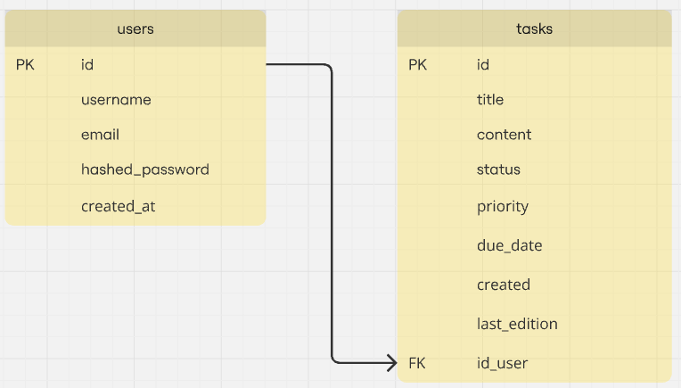

<h1 aling="center">Taskify</h1>

An API for task management built with FastAPI. It includes operations for creating, listing, and managing tasks with a modular structure and support for future expansion. This project serves as a portfolio example and demonstrates best practices in API development.

## Technologies Used:

- [Python](https://www.python.org/)
- [PostgreSQL](https://www.postgresql.org/)
- [Git](https://git-scm.com/)

## Libraries Python Used

- [FastAPI](https://fastapi.tiangolo.com/)
- [Uvicorn](https://www.uvicorn.org/)
- [Psycopg2](https://www.psycopg.org/docs/)
- [python-dotenv](https://github.com/theskumar/python-dotenv)
- [Bcrypt](https://pypi.org/project/bcrypt/)
- [PyJWT](https://github.com/jpadilla/pyjwt)

## Running the project:

Follow the steps below to set up and run the project locally:

1. **Clone the respository**:

   ```bash
   git clone https://github.com/RafaLima14028/Taskify.git
   cd Taskify
   ```

2. **Create a virtual environment**:

   ```bash
   python -m venv .venv
   ```

3. **Activate the virtual environment**:

   - **Linux/Mac**:

     ```bash
     source .venv/bin/activate
     ```

   - **Windows**:

     ```bash
     .\.venv\Scripts\activate
     ```

4. **Install dependencies**:

   ```bash
   pip install -r requirements.txt
   ```

5. **Run the application**:
   ```bash
   python main.py
   ```

### Observation

You may need to change the port for uvicorn if the default port is already in use.

## Project Structure:

```bash
├───.venv
├───app
│   ├───auth
│   │   ├─ db.py
│   │   └─ routes.py
│   ├───tasks
│   │   ├─ db.py
│   │   └─ routes.py
│   ├───users
│   │   ├─ db.py
│   │   └─ routes.py
│   └─ utils.py
├─── .env
├─── .gitignore
├─── main.py
├─── README.md
└─── requirements.txt
```

## Features:

...

## Routes:

- Tasks:

- Auth:

- Users:

## About database:



## About .env:

In the .env file there are some environment variables for the database and JWT (JSON Web Token).

```bash
POSTGRES_USER = "postgres"
POSTGRES_PASSWORD = "1234"
POSTGRES_HOST = "localhost"
POSTGRES_PORT = 5432
POSTGRES_DBNAME = "taskifyDB"

JWT_SECRET_KEY = "Taskify"
JWT_ALGORITHM = "HS256"
JWT_ACCESS_TOKEN_EXPIRE_MINUTE = 30
```
